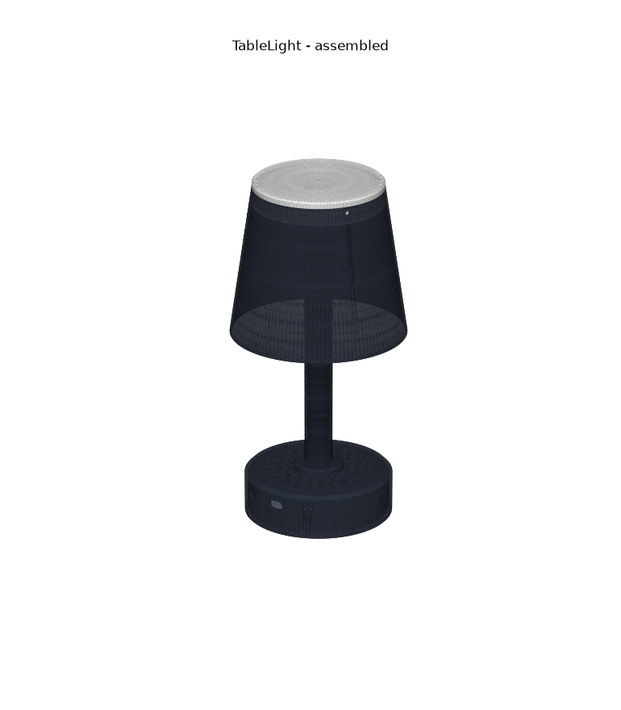
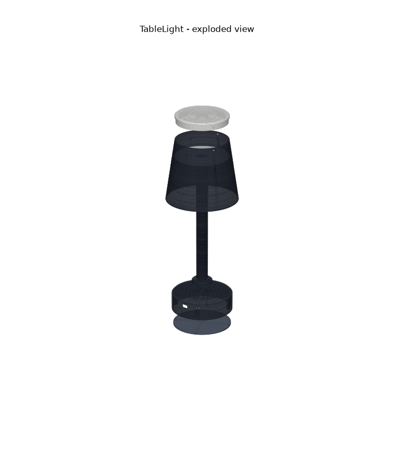
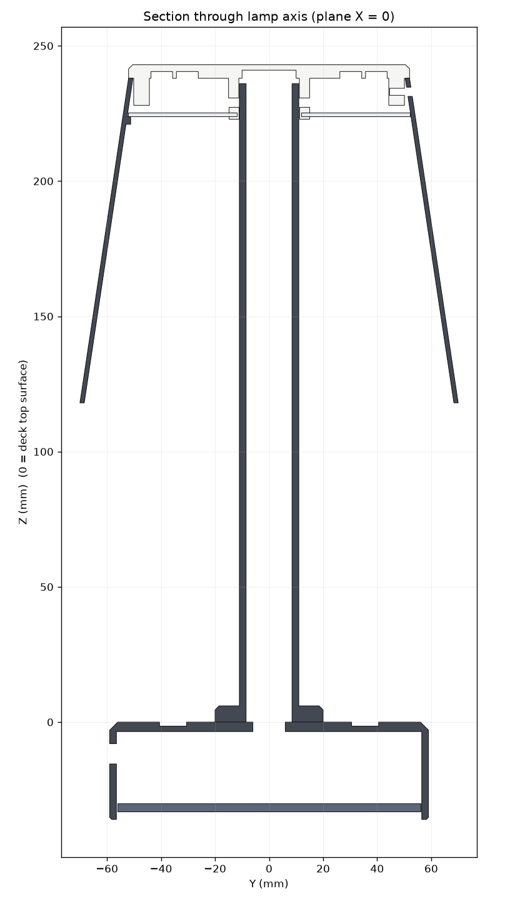
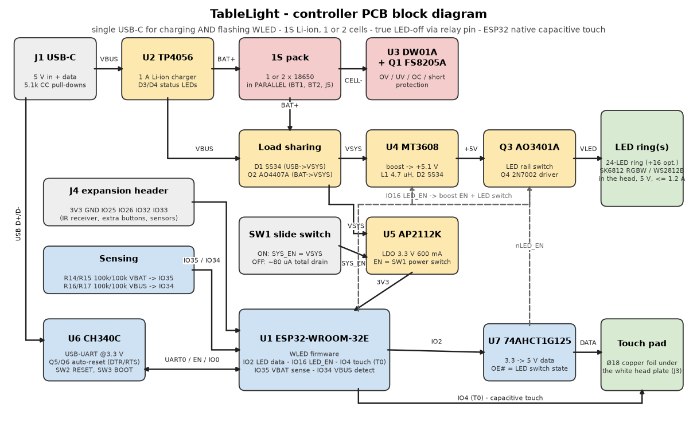

# TableLight

A 3D-printable, battery-powered, USB-C rechargeable table lamp in the classic "Poldina" shape - honeycomb
disc base, thin stem, down-firing cone shade with a white top - running [WLED](https://kno.wled.ge/) on an
ESP32, with a capacitive touch pad hidden under the white top plate.



| | |
|---|---|
| Size | Ø118 x 36 mm base, Ø22 stem, shade Ø140 -> Ø104 x 120 mm, 279 mm tall overall |
| Light | 24-LED SK6812 RGBW (or WS2812B) ring under the head, shining down through a diffuser; optional second 16-LED ring |
| Power | 1 **or** 2 x 18650 Li-ion in parallel (1S) in the base, USB-C charging (1 A) in the base, runs while charging |
| Control | WLED app / web UI / Home Assistant + touch on the white top (ESP32 native touch) |
| Electronics | one custom Ø110 mm PCB in the base (KiCad board + PCBWay Gerber/BOM/CPL package included); flashes WLED over the same USB-C port |
| Runtime | ~5 h at full reading brightness, ~12 h at mood brightness with two 3500 mAh cells (half with one cell) |

## What is in this repository

```
cad/tablelight.py          parametric CAD (Python: trimesh + manifold) - ALL dimensions live here
cad/stl/                   ready-to-print STL files (6 parts)
hardware/pcb/              custom controller PCB: SKiDL circuit, KiCad 7 board (kicad/), PCBWay fab package
                           (fab/: Gerbers, drill, BOM, pick-and-place), board generator, design notes
firmware/wled/             WLED build override + settings for this lamp
docs/BOM.md                complete bill of materials (printed parts, electronics, hardware, consumables)
docs/PRINTING.md           print settings and orientation per part
docs/ASSEMBLY.md           step-by-step build
docs/WLED_SETUP.md         WLED configuration (pins, 2D matrix, touch button, battery, current limit)
docs/images/               renders, section drawing, PCB placement, block diagram
```

## The parts



| STL | Qty | What it does |
|---|---|---|
| `base_shell.stl` | 1 | Honeycomb-topped base disc: the PCB hangs under its deck (components facing down), USB-C, power switch and charge LEDs in the side wall, 1-2 x 18650 inside |
| `base_bottom_plate.stl` | 1 | Screw-on floor with rubber feet; remove it to reach the batteries, buttons and connectors |
| `stem.stl` | 1 | Ø22 hollow stem with a Ø40 foot flange; screwed to the deck from below, carries the wires to the head |
| `head_plate.stl` | 1 | White top: stem socket, two LED-ring channels on the underside, skirt that the shade screws to, touch-pad recess |
| `cone_shade.stl` | 1 | Opaque cone Ø140 -> Ø104, open at the bottom; 3 nubs hold the diffuser, 3 radial screws hold it to the head |
| `head_diffuser.stl` | 1 | Ø104 translucent disc 14 mm under the LED ring so you never see bare LEDs from below |

Section through the assembled lamp (all clearances are modelled, nothing is glued):



## Electronics in one picture



Power path: USB-C -> TP4056 charger -> 1S pack (DW01A/FS8205A protected) -> load-share (Schottky + P-FET)
-> `VSYS` -> MT3608 boost 5.1 V -> P-FET LED switch -> LED ring in the head (via the stem); `VSYS` -> 3.3 V LDO -> ESP32-WROOM-32E.
The USB-C data lines go to a CH340C with auto-reset, so WLED is flashed through the charging port.
A slide switch in the base wall is the hard off (about 80 uA drain). WLED's "relay pin" cuts the LED rail so
standby is only the ESP32.

See `hardware/pcb/README.md` for the design rationale and `hardware/pcb/SCHEMATIC.md` for every net.

## Build order (short version)

1. Print the six parts (`docs/PRINTING.md`). Fit 12 x M3 heat-set inserts.
2. Order the PCB: upload `hardware/pcb/fab/tablelight-gerbers.zip` to PCBWay (`hardware/pcb/fab/README.md` has the form values). Flash WLED (`docs/WLED_SETUP.md`).
3. Tape the LED ring into the head plate, stick the touch foil in its recess, run the wires down the stem (`docs/ASSEMBLY.md`).
4. Screw the stem to the deck, plug the PCB in, screw the PCB to the deck bosses, fit 1 or 2 cells, screw the floor on.
5. Push the diffuser up into the cone, screw the cone to the head, push the head onto the stem and fix it with two screws. Done.

## Regenerating the CAD / PCB files

```
pip install -r requirements.txt
python3 cad/tablelight.py                    # STLs -> cad/stl, renders -> docs/images
python3 hardware/pcb/tablelight_netlist.py   # tablelight.net, bom_pcb.csv, SCHEMATIC.md
python3 hardware/pcb/board_outline.py        # outline.dxf, placement.svg, PLACEMENT.md
python3 hardware/pcb/build_board.py          # KiCad board -> autoroute -> DRC -> fab/ (needs KiCad 7 + freerouting.jar)
python3 docs/block_diagram.py                # block_diagram.svg/.png
```

Change a value in the `P = dict(...)` block at the top of `cad/tablelight.py` (shade size and taper, stem length,
base diameter, honeycomb size, ring diameters...) and everything that depends on it - head socket, cone screw
positions, wall openings, PCB placement drawing - follows. The stem is 236 mm tall as printed; set `stem_len`
lower if your printer's Z is under 240 mm.

## Safety notes

* Cells in parallel must be the same model and within ~0.1 V of each other when inserted. Never mix a fresh
  and a flat cell.
* The board has over/under-voltage, over-current and short protection (DW01A + FS8205A), but a lamp is a closed
  plastic box: keep the WLED current limit at or below 1200 mA and do not leave it charging on a cushion.
* Use a 5 V USB-C supply rated 2 A or more when charging and running at the same time.

## License

MIT for the code and design files. WLED is licensed separately by its authors.
