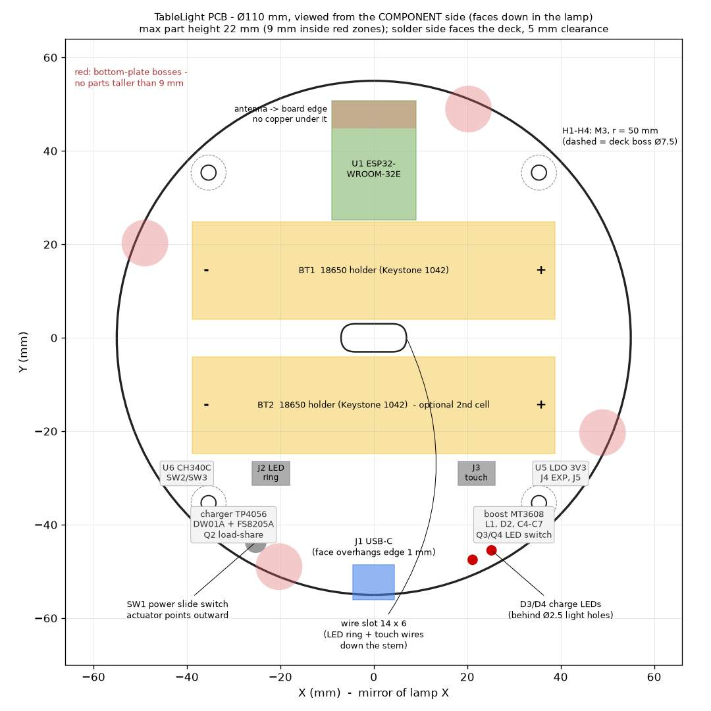

# TableLight controller PCB

Round Ø110 mm, 2 layer, 1.6 mm FR4. Lives in the base, components facing down, screwed to four bosses
under the base deck. One board does everything: charging, protection, boost, ESP32 + WLED, USB flashing,
LED power switching, touch input, battery sensing.

| File | What |
|---|---|
| `tablelight_netlist.py` | **the circuit** (SKiDL). Run it to regenerate the three files below |
| `tablelight.net` | KiCad netlist with footprints assigned. pcbnew: *File > Import Netlist* |
| `SCHEMATIC.md` | every net with every pin, plus per-component pin tables |
| `bom_pcb.csv` | PCB bill of materials (refs, values, example MPNs, footprints) |
| `board_outline.py` | reads the enclosure parameters and writes the three files below |
| `outline.dxf` | Edge.Cuts (Ø110 circle + centre wire slot) and reference layers. pcbnew: *File > Import > Graphics* |
| `placement.svg` / `PLACEMENT.md` | where the connectors, holders, module and keep-outs must go |

## Layout workflow

1. New KiCad project, import `outline.dxf` onto Edge.Cuts (the round outline and the wire slot) and the
   `Ref.Holes` / `Placement` / `Keepout` layers onto `User.Drawings`.
2. *File > Import Netlist* -> `tablelight.net`. All 72 footprints appear with the ratsnest.
3. Place per `PLACEMENT.md`: mounting holes H1-H4 at r = 50 mm on the 45 deg diagonals, J1 USB-C centred on
   -Y with its face 1 mm past the edge, SW1 at 240 deg, D3/D4 at the edge near 300 deg, U1 with the antenna
   at the +Y edge, BT1/BT2 either side of the centre slot.
4. Route. Power nets (`BAT+`, `CELL-`, `GND`, `VSYS`, `+5V`, `VLED`) carry up to 2.5 A: 1.5 mm+ traces or
   pours. GND pour both sides. Copper under U2 (TP4056) EP with a via array. Nothing under the module antenna.
5. Height limits (from the enclosure): 22 mm anywhere on the component side, 9 mm inside the four red boss
   zones, 3 mm of lead length on the solder side.

If you prefer a schematic editor: the pin tables in `SCHEMATIC.md` are complete; redrawing it in KiCad's
eeschema takes about an hour and the netlist import then verifies your drawing against this reference.

## Design notes and calculations

**Cells.** 1S, one or two 18650 in parallel. Parallel cells need no balancing; they must be the same model
and within ~0.1 V when inserted. `J5` is a JST-PH alternative for a wire-lead holder or a pouch cell.

**Protection.** DW01A + FS8205A, the same topology as the ubiquitous TP4056 module: the two FETs sit in the
cell-negative path, `CELL-` is the raw cell terminal and `GND` is the protected side. Over-discharge 2.4 V,
over-charge 4.3 V, over-current ~3 A (with the 8205A's 2 x 25 mOhm). Dissipation at 2.5 A: 0.3 W.

**Charger.** TP4056, `R3` = 1.2k -> 1.0 A. 2 x 3500 mAh charge in about 8 h, one cell in 4 h. Use `R3` = 2k
(0.58 A) if it will mostly be charged from a laptop port. Dissipation worst case (5 V - 3.0 V) x 1 A = 2 W at
the start of charge: give U2's pad a big pour, the IC throttles thermally anyway. `TEMP` is grounded (no NTC).
CC1/CC2 pull-downs (5.1k) so USB-C to USB-C cables and PD chargers supply 5 V.

**Load sharing.** `D1` (SS34) feeds `VSYS` from `VBUS` while plugged in; `Q2` (AO4407A, 12 mOhm) connects the
pack to `VSYS` only when `VBUS` is absent (gate tied to `VBUS`, `R8` pull-down). The charger therefore only
ever sees the cell, so termination works, and the lamp runs at full power while charging. Q2 drop at 2.5 A:
30 mV.

**Boost.** MT3608 at 1.2 MHz, `R9`/`R10` = 75k/10k -> 5.1 V. 4.7 uH / 4 A inductor, 2 x 22 uF in, 2 x 22 uF
out plus 100 uF on `VLED`. Practical continuous output from a 3.3 V cell is about 1.5 A at 5 V, hence the
WLED current limit of 1.2 A (24 + 16 LEDs at full white would ask for 2.4 A). `EN` is driven by `LED_EN`
(GPIO16), so the converter idles when the light is off.

**LED rail switch.** `Q3` (AO3401A) between `+5V` and `VLED`, driven by `Q4` (2N7002) from `LED_EN`. WLED's
"relay pin" feature raises GPIO16 whenever the strip is on. `R11` keeps the LEDs off during boot. With the
rail off the ring draws nothing, so standby is only the ESP32 (~80 mA with WiFi, ~10 mA with WiFi sleep).

**Level shifter.** SN74AHCT1G125 powered from `+5V`, input from GPIO2, 330 R into the data line. Its `OE#`
is tied to the Q3 gate node, so the data output is high-impedance while the rail is off - no back-powering
the ring through its data pin.

**3.3 V.** AP2112K-3.3 from `VSYS` (works from 3.0 to 5 V input, 250 mV dropout at 600 mA). Its `EN` pin is
the power switch `SW1`: OFF disables the LDO, the ESP32 dies, `LED_EN` falls, boost and LED rail switch off.
Off-state drain is about 80 uA (LDO + DW01 + the two 100k/100k dividers + the boost FB divider): years.

**USB-UART.** CH340C at 3.3 V (`V3` tied to `VCC`), no crystal. Standard NodeMCU auto-reset with two NPNs
(DTR/RTS -> EN/IO0) so esptool and the WLED web installer work hands-free. `SW2` RESET and `SW3` BOOT for
manual recovery. USBLC6-2SC6 on D+/D- is optional ESD protection.

**ESP32 pins.** GPIO2 LED data, GPIO16 LED rail enable (relay pin), GPIO4 (T0) touch, GPIO35 battery voltage
(100k/100k, x2.0), GPIO34 VBUS detect (100k/100k), GPIO25/26/32/33 on the expansion header `J4`. Strapping
pins 12 and 15 are left unconnected; GPIO0 has a 10k pull-up.

**Touch.** ESP32 native capacitive sensing through 2 mm of PLA with a Ø18 foil disc under the head plate.
`R22` (1k) is ESD/series protection; use 0 R if the sensitivity is marginal. The touch wire runs 250 mm down
the stem next to the LED wires: keep it away from the data wire if possible (twist it with the GND wire).

## Bring-up (bench, before installing)

1. No cells. Plug USB-C: D3 or D4 flashes, `VSYS` ~4.6 V, `3V3` = 3.3 V with `SW1` on, the CH340 enumerates.
2. Flash WLED. It should boot and start its AP.
3. Insert one cell. Unplug USB: the lamp keeps running from the cell (Q2). `BAT+` divider reads on GPIO35.
4. Connect the ring to `J2`, turn the light on in WLED: `VLED` = 5.1 V only while on.
5. Plug USB with the cell in: D3 (red) while charging, D4 (green) when done. Q2 should be cold.

## Ordering

Any 2-layer service. JLCPCB economic assembly can place every SMD part on the single component side; the
THT parts (holders, USB-C is SMD, slide switch, JST headers, pin header) are a 20 minute hand solder.
The board is Ø110, so it falls in the 100-150 mm price tier; a Ø100 variant fits a Ø108 base
(`base_r_out=54`, `pcb_r=50`, `pcb_hole_r=45` in `cad/tablelight.py`, then regenerate).
